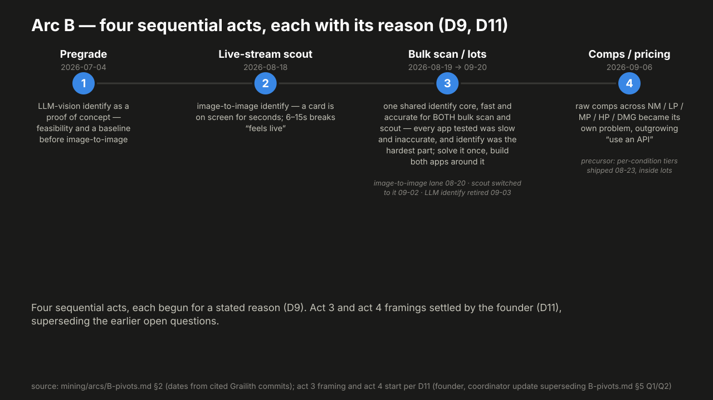
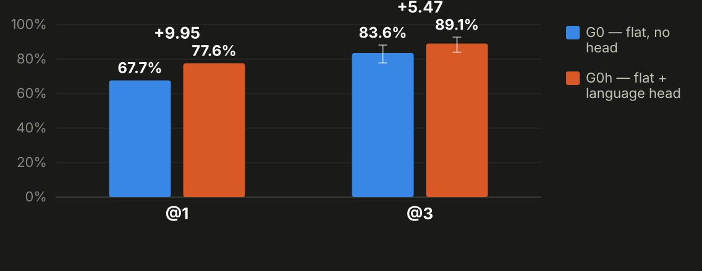
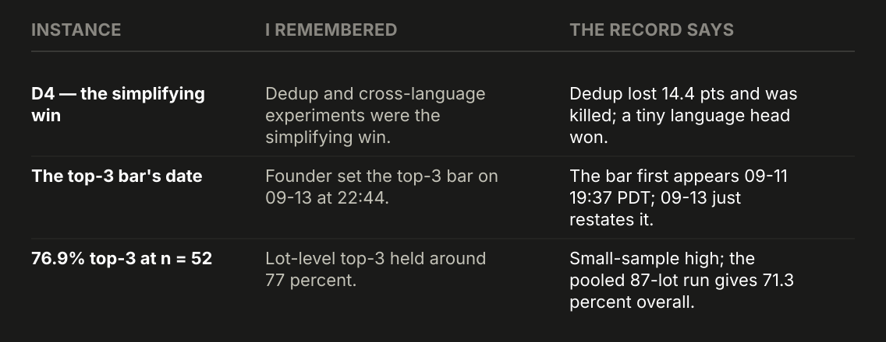
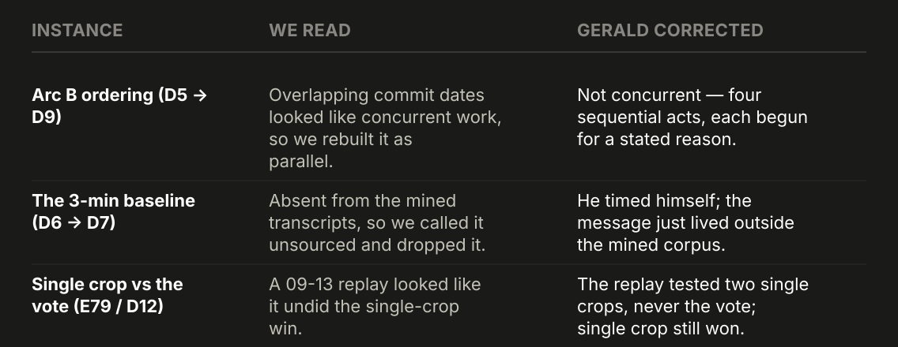

<!-- _class: lead -->

# How to scale yourself
## and do all the things

Explore every fork without stopping the job you're doing.

Gerald Sornsen · github.com/gsornsen/htsysadath

<!--
Hi, I'm Gerald. This talk is about a fork in the road: the moment a hard problem lands in the
middle of a project and your instinct says push through. I want to show you that stepping back
has become cheap, and how I explore several forks at once while I keep doing my actual job.
Everything I show you today is in a public repo, with its sources, so you can check me — the
URL is on screen the whole talk [D1].
-->

---

## The jitter

- The scout's detect→identify boundary: results about every 500 ms, matches shown then overridden.
- 3 areas × 3 parts × ~5 experiments = 45+ forks for one bug.

<!--
Early on with the scout, a browser extension that identifies trading cards on live auction
streams, I was stuck at the boundary between detect and identify. The client sees a card, cuts a
crop, sends it to the server for an embedding, and runs an image-to-image search [abstract]. We
got results about every 500 milliseconds [abstract; P1]. Everything under the presentation layer
looked promising. On screen it was jittery: it showed a match, overrode it, showed another
[abstract; G:45b8bddb7 · 08-18; G:70b2f1b9e · 09-02]. I could attack it in three areas — the UI,
card detection, or how we generate embeddings. Each area had about three parts of the system to
explore, and each part had about five experiments [abstract]. 3 areas × 3 parts × ~5 experiments
= 45+ forks for one bug.
-->

<!-- ending (D14; WHERE it is said depends on Gerald's story-plan answer Q2, early vs payoff): "The data showed us where it was flapping. A 3x faster server cut thrown-away answers from 36 to 15 in every 100; then one behaviour change, cancel the request but keep the answer, took it to about 1 in 700. Three days from the first instrumented complaint." [D14; E19: 35.8 -> 15.4 -> 0.14 per 100, against a control] -->

---

## Why we push through

- Scope, staffing and timeline make "pick the fix I know and push" the default.
- Identify wasn't fast enough to win an auction, and the project came close to being parked.

<!--
Every project is boxed by scope, staffing and timeline [brief]. When a problem like that lands,
the default is to lean on what you already know and push through. There's no time, no spare
people, and maybe nobody on the team who knows the alternatives. The pressure was real for me.
Identify wasn't fast enough end to end to win an auction, and the project came close to being
parked [D4]. With forty-five forks and one of me, the honest move used to be: pick the fix I
know best, ship it, and hope. I think that math has changed, and the rest of this talk is what
changed it.
-->

---

<!-- _class: demo -->

## Exploring got cheap — live demo kickoff

Instrument the key transitions, replay offline: ~100 experiments in two weeks, many gated and run overnight.

$ demo/fanout

Four writers start now on my rough abstract — back to the deck when the fan-out is running.

<!--
The unlock wasn't a smarter model. It was instrumentation. We sent the key transitions to
PostHog and made sure every fire could be replayed offline from recorded frames and fire records
[P2; G:1267e680e · 08-22; G:3c52c2b72 · 09-04]. Once that existed, a team of agents and I ran
about 100 experiments in two weeks, many of them gated and run overnight [D13; abstract; P3].
Each ran in its own git worktree against the same frozen data [P3]. Each was a hypothesis with a
gate: when a gate cleared, the work merged and the next experiment unlocked [abstract; P4]. So
let me prove it on something small. I'm starting four writers on my own rough abstract, right
now.

Stage (0.5 min, Demo 1 kickoff).
1. Advance to the `_class: demo` link-out slide and click it. The terminal is already in the demo
   clone at tag `talk-demo`, prompt `$ `, 28 pt [plan §1, §4].
2. Run `demo/fanout`. Say while it starts: "Executive, engineer, designer, product manager. Each
   one gets my rough draft and a persona brief."
3. When the four lane lines appear (about 30 s), say: "They'll be done before we need them. I'm
   not going to wait." Return to the deck by URL hash to slide 5.
4. If the lanes haven't started after 15 s, don't debug on stage. Say "I'll show you the
   recording when we get there" and go on. The fallback is the ~2-minute video at slide 13 (D10).
-->

---

<!-- _footer: "Source: mining/arcs/B-pivots.md; act 3–4 framing per D9/D11" -->

## Four acts, each with a reason

Pregrade → scout → shared core → comps — each act began for a different reason.

<!--
How did the product get here? Four acts, each with its own reason [D9]. Act 1, pregrade, shipped
day three of the repo in early July: an LLM vision call reading the collector number, a
deliberate proof of concept to prove the job was feasible before moving to image-to-image — not
a false start [D9; arc B; G:f7a484e95 · 07-04]. Act 2, the scout, started August 18th: live
auctions gave identify 6 to 15 seconds, too slow, so a one-night, three-lane bakeoff pitted
vision against embeddings against the act-1 baseline. Vision won accuracy at 5 of 6 right;
SigLIP won speed at 44 ms [arc B; G:e04b6433b · 08-18; G:423e2e894 · 08-20]. The embedding became
a ranker, never an authority on its own [arc B]. Act 3 is where commit dates would tell the story
wrong: identify was the hardest part of the whole system, needed by both bulk scan and the
scout, so I solved it once as a shared core and built both apps around it. Bulk scan got it
August 20th, the scout September 2nd, and the old LLM lane retired September 3rd [D11; arc B;
G:5f76f4810 · 08-20; G:06119bc92 · 09-02; G:0d12da755 · 09-03]. Act 4, comps, started September
6th: pregrade had gotten by with graded comps and a near-mint price feed, but the job changed
shape when I needed raw comps at every condition, from near mint down to damaged — a much bigger
problem than "call an API" [D9; D11; arc B]. Solve the hardest shared piece first, then you're
free to focus elsewhere.
-->

---

<!-- _footer: "Source: mining/findings/E67-top3-replay.md" -->

## The negative result was the win

A pre-registered kill line turned de-duplicating the index into a no — then found the win.

<!--
Back to identify, and the one experiment that changed my mind the most [D4]. Japanese cards were
scoring higher similarity than English ones. A census found 96.14 % of 19,258 Japanese renders
had an English twin with identical art [arc A]. My instinct was to de-duplicate the index. That
version tested against a kill line written down before the run. It lost 14.43 points of top-1,
and the kill fired [arc A]. Scoring past it, keeping the flat index and adding a small language
head lifted top-1 from 67.66 % to 77.61 % on a 201-crop test split — 20 fixed, none broken
[arc A; E67-top3]. It shipped on 09-09 [arc A]. The idea I expected to win lost, and that loss
found the change we shipped.
-->

---

<!-- _footer: "Source: mining/findings/E67-top3-replay.md" -->

## At top-3, the gain halves

Same win, product units: +9.95 at top-1 becomes +5.47 at top-3.

<!--
But my bar is top-3: the right card somewhere in the picker's three candidates [top3-traj]. We
replayed the saved vectors at top-3, after checking that the replay reproduced the top-1 numbers
exactly [E67-top3]. The win holds: top-3 goes from 83.58 % to 89.05 %, 12 fixed and 1 broken
(McNemar p = 0.0034) [E67-top3]. But it's +5.47 points, not +9.95. Why? Of the 20 crops the head
fixed at top-1, 13 already had the right print at rank 2 or 3 [E67-top3]. That's one fixed test
set of 201 crops — a split frozen before any run touched it [E67-top3]. Same experiment, same
code, half the headline. The metric you pre-register is a decision too [arc A].
-->

---

## What the gates let us stop

- SigLIP2 encoder swap: 9.55 points down — stopped.
- Fine-tune and a distilled student: both failed their bars.
- Re-embedding the reference art: never started.
- Paying for more Japanese art: zero lift, didn't scale.

<!--
Gated experiments pay off as much in what they let you stop. We stopped a SigLIP2 encoder swap
that came in 9.55 points down [G:ledger · E57]. The fine-tune and the distilled student both
failed their bars [G:ledger · E58, E53d]. We never re-embedded the reference art [G:ledger · E12,
E39]. And paying for more Japanese art showed zero lift, so we didn't scale it [G:ledger · E119].
A lot of the "about 100" were tests like these — the ones that saved time by returning a clean
no.
-->

---

<!-- _footer: "Source: mining/findings/top3-trajectory.md" -->

## Four yardsticks, not one line

We measured top-3 four different ways — you can't draw one line through them.

<!--
And a caution about that "about 100": we measured top-3 four different ways. Crops as served:
78.2 %. The same crops scored offline: 74.3 %. A six-crop consensus proxy: 70.3 % up to 82.9 %.
And live lots, pooled: 71.3 %, with 65.2 % on the lots that never auto-locked [top3-traj;
lot-top3]. Four yardsticks. You can't draw one trend line through them.
-->

---

<!-- _footer: "Source: mining/findings/lot-top3-unlocked.md" -->

## The bar, measured

On live lots: right card in the top 3 about two times in three (n = 87).

<!--
So how good is the scout by my own bar? We ran every truth lot in the record: 87, not the 200 I
asked for [lot-top3; D8]. The scout auto-locks a lot — commits to an answer without a human
check — when its own confidence clears a threshold; that happened for 18 of the 87 lots, 20.7 %,
and 16 of those 18 were right, 88.9 % [lot-top3]. On the 69 lots it didn't lock, the right card
was in the top 3 on the last fire in 45: that's 65.2 %, with an interval of 53 to 75 % [lot-top3].
The truth here is my own taps, one tapper, five days of streams [lot-top3]. About two in three.
Not done, but now it's measurable, and I know which number to move.
-->

---

## The panel is the done gate

- **Persona brief (Dez):** 22, phone-only, one thumb — job: "swipe-fast, not homework."
- **Verdict:** Dez — DONE — 9 s (was 30 s).
- **Literal ask → job:** "bulk-approve my 92 tasks" → "don't make me re-click my own answers" → shipped, zero clicks.

<!--
For design forks, the gate is people, or stand-ins for them. On September 13th I made a design
panel the done gate. Code-done isn't done [arc C]. There are four fictional personas, each a
short brief with a device and a job — Dez, for example, is 22, phone-only, one thumb. Then three
critics with a lens instead of a backstory [arc C]. They re-walk the built screens and return
DONE or NOT, with blockers, and log a seconds-per-task number: Dez went from 30 seconds to 9
[arc C]. They also translate literal asks into jobs. I asked for a bulk-approve button. The job
turned out to be "don't make me re-click my own answers," and that shipped with zero clicks
[arc C]. The persona timings are simulated, not human [arc F].
-->

---

## The gate fails

- Panel said DONE on the phone; my iPhone said "pretty much unusable."
- Three scrolling sections · a help modal reopening every task · rotate to reach some options.

<!--
And then the gate failed. The second panel pass, at 21:50 on the 13th, had Dez DONE at 8 seconds
with no scrolling to reach Submit [arc C]. At 09:40 the next morning I opened the deployed app on
my own iPhone, and it was pretty much unusable: three scrolling sections pushing content
off-screen, a help modal reopening on every task, and I had to rotate the phone to reach some
options [arc C]. The panel walked Storybook at a fixed viewport. It never saw iOS browser chrome
or the real flow between tasks [arc C]. The fix was another pass, this time allowed to start from
a blank canvas [arc C]. The panel is necessary. Your own hands on the real device are still the
last gate.
-->

---

<!-- _class: demo -->

## Live demo: persona fan-out — reveal

Four drafts, each from a persona brief — I pick a hybrid aloud.

<a href="http://localhost:8090/" target="_blank">Open the fan-out viewer →</a>

<!--
Remember the four writers from minute four? Here's what they did with my rough abstract [D10].
Executive, engineer, designer, product manager — I'll read the first line of each draft, not the
full 200 words, then pick a hybrid aloud: the tl;dr frame from one, the drill-down order from
another, one cut. I'll say each choice out loud. The real pass takes me about ten minutes; this
is the two-minute version.

Stage (4.0 min).
1. Click the link-out slide; switch to the viewer tab on `localhost:8090`, opened before the talk
   [plan §1].
2. Show the rough draft on the left for five seconds, then the four columns. Read the first line
   of each column aloud and name each persona.
3. Choose aloud: tl;dr frame from draft X, drill-down order from draft Y, one cut. Default is no
   audience vote (plan Q8).
4. If a lane hasn't finished or the viewer is blank after 15 s, say "Here's the same run,
   recorded earlier" and play Gerald's ~2-minute video (D10). Say it's recorded. Never present
   it as live. There is no labelled-rehearsal fallback any more (D10). If the live reveal is
   stuck, this is the moment to cut to that video rather than debug on stage.
5. Return to the deck by URL hash at slide 14.
-->

---

## The hybrid rule

tl;dr frame on top, drill-down beneath for whoever needs detail.

<!--
This is the rule, not a placeholder. A tl;dr frame on top that the busy reader actually finishes,
then drill-down levels beneath for the curious and for whoever needs the data [D4]. Nothing had
gone wrong with a single long doc — the failure it replaced was writing docs too long to be read,
which forced the very meetings the doc was meant to replace [D4]. So when I pick, I'm not grading
the four drafts against each other. I'm pulling: the tl;dr from whichever draft says it clearest,
the drill-down order from whichever structures the detail best, and I cut whatever doesn't serve
either reader. I kept talking to you for eleven minutes while four versions were written, and
choosing took two.
-->

---

<!-- _footer: "Source: mining/arcs/F-agent-labeling.md" -->

## Two levers, not one

180 s by hand → ~31–46 s with agents + review.

<!--
Labeling card crops by hand took me about three minutes a label — 180 seconds, my own stopwatch
on the first labeler build; the original message isn't in the record we mined [D7]. With agents
doing the first pass, that dropped to 11 to 16 seconds of agent wall time [arc F]. Add a human
review pass after a persona-driven redesign, about 20 to 30 seconds, and the fair total is about
31 to 46 seconds end to end — agent plus review, not agent alone [D7; arc F]. Two levers: agents
took the first pass, and a redesign made review fast. Crediting agents alone would overclaim.
-->

---

<!-- _footer: "Source: docs/project/tracking.md + this repo's own merge log" -->

## The coordinator pattern

- **Lane** — one task, its own branch + worktree. **Worktree** — an isolated checkout; lanes never collide.
- **Gate** — a pass/fail check, written first. **Reviewer, one tier up** — never a peer.

This repo's own lanes: the coordinator wrote the brief, cheaper models built to it. <small>Coordinator = Fable, this session's own name.</small>

<!--
So how did about 100 experiments run while I slept? With a coordinator pattern — this repo's own
lanes are drawn on this chart. One senior session, the coordinator, writes the spec: files,
signatures, acceptance tests, what's off limits. Cheaper models build to it [arc E]. The reviewer
always sits one tier above whoever wrote the work, never a peer [arc E]. Lanes commit early,
because a usage limit killed three build lanes mid-work on September 7th [arc E]. That night at
23:00 I asked what was prepped to run overnight, and the queue ran on its own until 07:00 [P4;
G:backlog]. It isn't free — an early rule to let the swarm steer itself broke the next day, and I
had to keep correcting it [arc E].
-->

---

<!-- _class: demo -->

## Live demo: the repo's own record

Three stops: fan-out merges; two memory corrections; tiered review merges.

$ git log --graph --oneline main

Fallback: the coordinator pattern (slide 16's chart).

<!--
This talk was built the same way, and the log is public. Three stops. First, mining lanes fanning
out and merging back, with merge messages that say what was learned [3de113f]. Second, two
corrections. At 08:22 we dropped my three-minute number as unsourced. At 08:29 we reversed that,
after asking the one person who was there: me [767b0c4; 7fefd2f; D7]. The same thing happened
between 08:19 and 09:27, when the log said the product work was concurrent and I said it was
sequential [b1d7e8f; 7607585; D9]. Third, review merges, each reviewed by a model one tier above
the one that wrote the work [a0641ea; 6b0d9b9; 1f3a3f7; arc E]. ⟨Quote the commit count on main
on the day; it was 75 at 09:5x PDT on 09-24.⟩

Stage (3.0 min).
1. Click the link-out slide to the terminal, in the demo clone on `main`.
2. Use the aliases only; no typing, no network [plan 02]. The graph is `git log --graph --oneline
   main`, never `--all`, so no worktree branches show [plan 02].
3. Stop 1 at `3de113f`; stop 2 at `767b0c4` → `7fefd2f`, then `b1d7e8f` → `7607585`; stop 3 at
   `a0641ea`, `6b0d9b9`, `1f3a3f7`. Read the one-line subject at each stop; don't scroll bodies.
4. Fallback: the coordinator pattern slide (#16) [plan §2]. Return by URL hash to slide 18.
-->

---

<!-- _footer: "Source: decisions.md D4/D6–D7/D12; top3-trajectory.md; lot-top3-unlocked.md" -->

## Remembered vs recorded

Three times, the record corrected my memory.

<!--
Three times, the record corrected my memory [plan §2]. I remembered the de-duplication work as
the simplifying win; the record says its own kill fired and a small language head shipped
instead — the negative result was the win [D4; arc A]. I dated my top-3 bar to the 13th; the
docs have it on the 11th [cross-arc]. And 76.9 % on 52 lots was a small-sample high — on 87 lots
it's 71.3 % [lot-top3].
-->

---

<!-- _footer: "Source: decisions.md D5/D7/D9/D12; EXP-E79 (177749ea6)" -->

## …and the record over-read

Three times, it went the other way.

<!--
Three times, it went the other way. Overlapping commit dates were read as concurrent work, when
the acts were sequential [D9]. A message outside the mined corpus was read as unsourced, when it
was founder testimony [D7]. And a "replay" that compared two single crops was read as undoing my
single-crop win over the five-crop vote — it never re-ran the vote; that win stands, 31 versus 26
of 41 [D12; E79b]. So keep both records, and check in both directions.
-->

---

## Against paralysis

- An evidence threshold written before the run.
- A time box and a budget.
- "Go both" when it's reversible.
- A log of the paths not taken.

<!--
Cheap exploration can turn into analysis paralysis dressed up as rigor. To be honest, the record
names that risk, but I couldn't find a dated incident of it [arc E]. What kept it in check were
four habits. An evidence threshold written before the run, like the de-duplication kill line
[arc A]. A time box and a budget: the labeling agent was capped at 8 calls, 60 seconds and $6 a
run [arc F]. "Go both" when it's reversible: the language head shipped first as a shadow ranker
next to the served one [G:ledger · E65a]. And a log of the paths not taken, which is what the
"what the gates let us stop" slide was. Decide on the evidence you have, and write down why.
-->

---

## Two things for next week

- Persona-draft your next doc.
- Run your next fork as two gated lanes.

github.com/gsornsen/htsysadath · starter kit: starter/

<!--
Here's what I'd tell a colleague. Two things for next week. One: persona-draft your next doc —
four short briefs, four drafts, ten minutes to merge them into a hybrid [D4]. Two: run your next
fork as two gated lanes — write the gate first, put each option in its own worktree, and let a
stronger model review before you merge [arc E]. When you give agents the right context, the
right autonomy and the right guardrails, they work like extra copies of you on a problem while
you focus on something else [abstract]. Everything's in the repo: github.com/gsornsen/htsysadath,
and a starter kit at starter/. Thanks.
-->

---

## Backup: cost, and the open question

- All Claude work ran within a Claude Max subscription.
- Only metered spend: the labeling pilots.

<!--
All of the Claude work ran within Gerald's Claude Max subscription budget — no separate Claude
spend. The only metered model spend in the record is the labeling pilots' vision-model calls:
about $9 for a 760-task run [D13]. Hold-out check (E67's 201 test crops vs the E65a head's 432
real training crops): held out: 0 of the 201 test photos were used to train or tune the head. It trained on catalogue images only, and its one knob was set on a separate dev split [D14]. Caveat if pressed: the head has seen the catalogue render of the true card, which is the gallery, known at inference, not leakage.
-->
