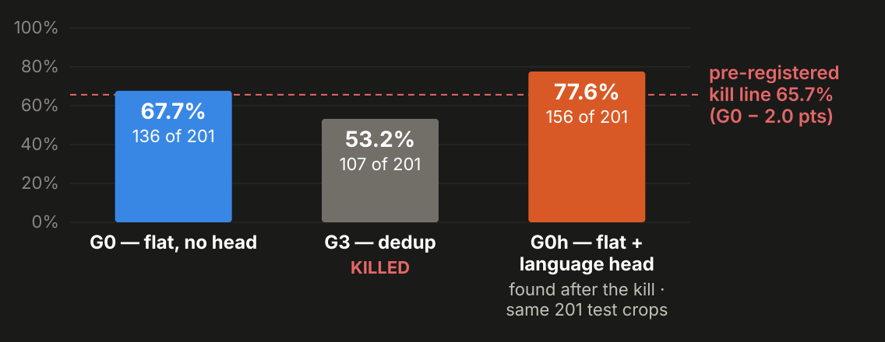
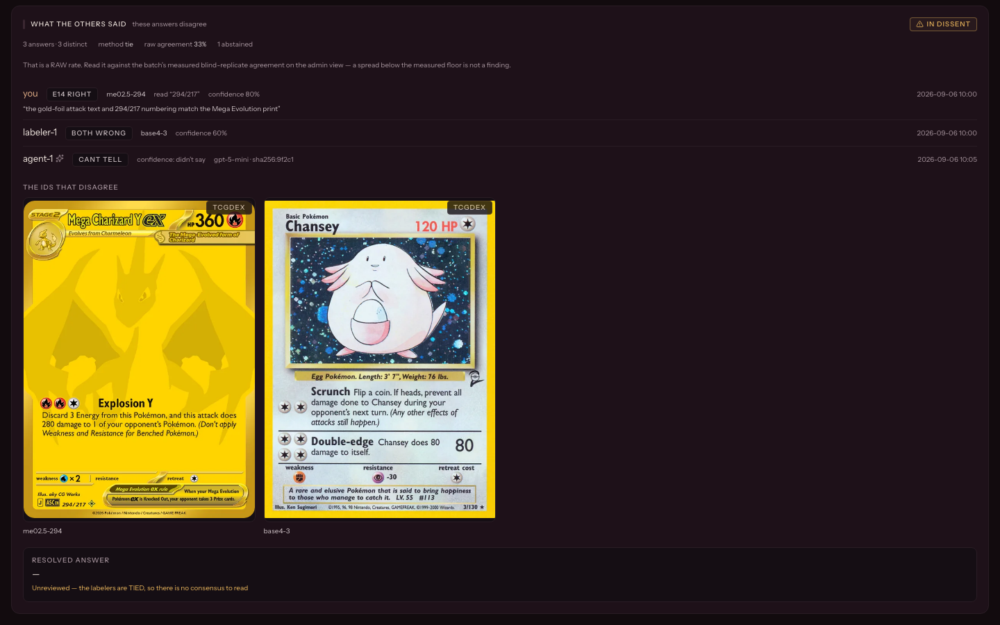
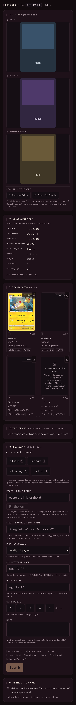
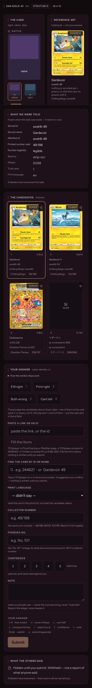
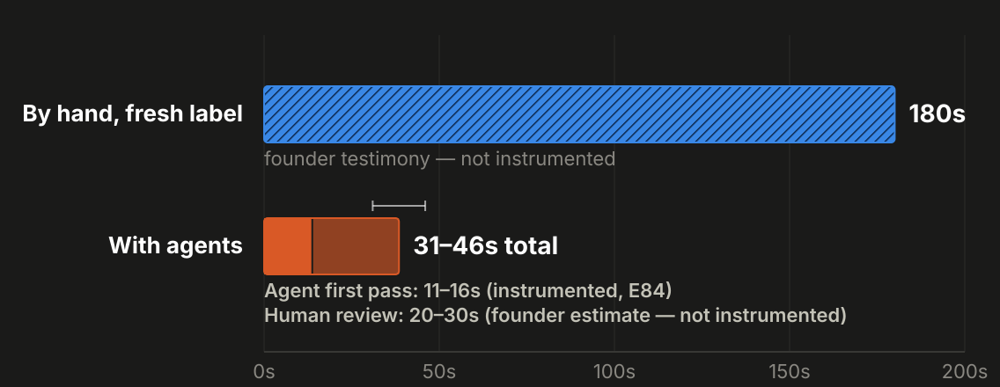
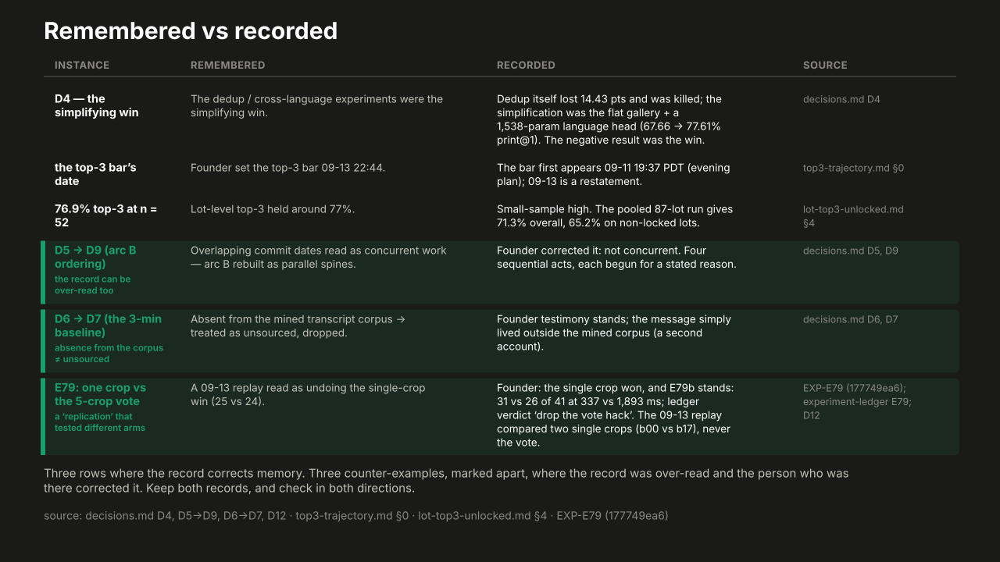

<!-- _class: lead -->

# How to scale yourself
## and do all the things

Placeholder: title, subtitle, speaker byline.

<!-- notes: slide 1 -->

---

## The moment ⚠

One real fork, told straight (Q3: which fork opens the talk) — the scout's jittery
detect→identify boundary: results every ~500 ms, matches presented then overridden.

<!-- notes: slide 2 -->

---

## Why we push through

Scope, staffing, timeline — the ordinary reasons a fork in the road gets walked past
instead of explored.

<!-- notes: slide 3 -->

---

<!-- _class: demo -->

## Live demo: persona fan-out — kickoff ⚠

Exploring got cheap.

$ demo/fanout

Back to the deck when the fan-out is running.

<!-- notes: slide 4 -->

---

## Pregrade: LLM-vision identify (07-04)

Act 1 of arc B — one-card LLM-vision identify as a proof of concept and baseline.

<!-- notes: slide 5 -->

---

## Scout: image-to-image (08-18)

Act 2 of arc B — the bakeoff: vision got 5/6 at 10.4 s; embedding took ~130 ms.

<!-- notes: slide 6 -->

---

## Bulk scan: fast lane (08-20) ⚠

Act 3 of arc B — the fast lane shipped 08-20; the LLM lane retired 09-03; the scout
had 0 commits 08-19 → 09-01. "Ported from the scout" or "designed for the scout,
proven in bulk scan" — pending confirmation.

<!-- notes: slide 7 -->

---

## Comps: raw comps by condition ⚠

Act 4 of arc B — comps by condition (NM–DMG) outgrew "use an API". Does it start
08-23, or 09-06/07 — pending confirmation.

<!-- notes: slide 8 -->

---

## The discriminating experiment

D4: the negative result was the win.

<!-- notes: slide 9 -->

---

## At top-3, the gain halves

+9.95 → +5.47, because 13 of the 20 fixes were already rank 2–3.

<!-- notes: slide 10 -->

---

## What we didn't try

Top-3 measured four structurally incompatible ways — none of them forms a trend.

<!-- notes: slide 11 -->

---

## Lot-level top-3 accuracy

Non-locked lots: 65.2% top-3 (45/69). Locked: 20.7% of lots, at 88.9% precision.

<!-- notes: slide 12 -->

---

## The panel as done gate

Placeholder: the review panel mechanism, before it broke.

<!-- notes: slide 13 -->

---

## The gate fails

Dez marked DONE on 09-13; "pretty much unusable" on the iPhone on 09-14.

<!-- notes: slide 14 -->

---

<!-- _class: demo -->

## Live demo: persona fan-out — reveal ⚠

Draft + 4 columns; a hybrid chosen aloud, per D4.

[Open the fan-out viewer →](http://localhost:8090/){target="_blank"}

<!-- notes: slide 15 -->

---

## What I took from each draft

Placeholder: the one line taken from each of the four persona drafts.

<!-- notes: slide 16 -->

---

## Two levers, not one

180 s (hand) → 11–16 s (agents) → ~20 s (human review), trust tiers tagged on the slide.

<!-- notes: slide 17 -->

---

## Coordinator: the reviewer sits one tier above

Placeholder: the curated lane DAG, model tier per node.

<!-- notes: slide 18 -->

---

<!-- _class: demo -->

## Live demo: the record itself

`git log --graph --oneline main` — three stops: fan-out merges; D6→D7 and D5→D9;
review merges.

$ git log --graph --oneline main

Fallback: the coordinator lane DAG (slide 18's chart).

<!-- notes: slide 19 -->

---

## Remembered vs recorded

Four rows where the record corrects memory, two counter-example rows marked apart.

<!-- notes: slide 20 -->

---

## Against paralysis

An evidence threshold. A time box. "Go both" when it's reversible. Log the paths
not taken.

<!-- notes: slide 21 -->

---

## Two things for next week

Persona drafts of your own next decision. A coordinator, plus lanes.

<!-- notes: slide 22 -->
