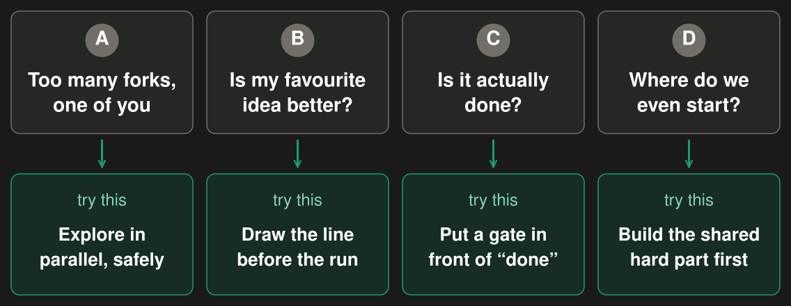
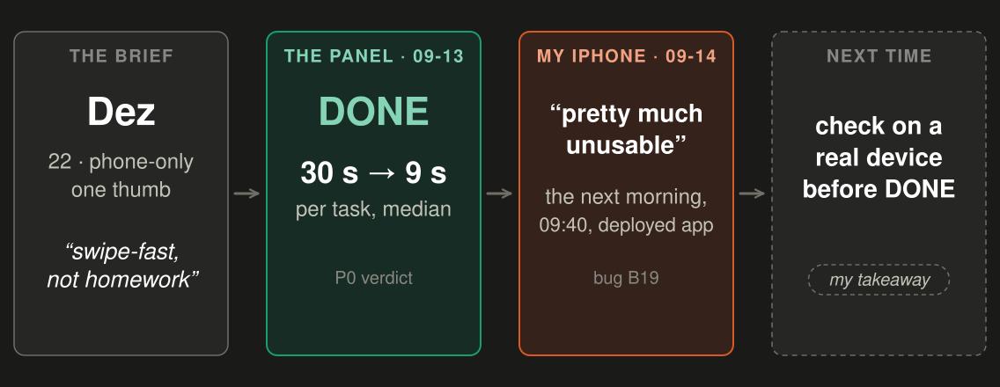

<!-- _class: lead -->
<!-- _paginate: false -->

# How to scale yourself

## Methods for when a hard problem lands mid-project

Gerald Sornsen · github.com/gsornsen/htsysadath

<!--
Hi, I'm Gerald. This talk is about a moment you've probably had: a hard problem lands in the middle
of a project, and there are more ways to fix it than there is of you. I'll show you the methods I
used when it happened to me, where you'll meet the same problems in your own work, and one thing to
try for each. It's my own project, told in first person, and every claim is written up in a public
repo with where it came from, so you can trace it [D1; D16].
-->

---

<!-- _class: moment -->

## You've been here

A hard problem lands mid-project.

Five fixes that might work. One week. One of you.

The default: pick the fix you know, and push.

<!--
Here's the moment. You're halfway through a project and something hard lands: a bug you can't pin
down, a performance wall, a design that doesn't hold up once it's built. You can see five fixes
that might work. You have a week, and there's one of you, or one small team. Every project is boxed
like that, by scope, staffing and timeline [brief]. So the default is to pick the fix you know best,
push through, and hope. Sometimes that works. When it doesn't, you've spent the week and learned one
thing. Nothing on this slide is data; it's the situation. Here's my version of it, and then what I
did instead.

**Stage.** Pause after the third line. Optional: "Who's had one of these this month?" Don't count
hands, don't comment.
-->

---

<!-- _footer: "Source: mining/arcs/B-pivots.md; decisions.md D17 (usernames pixelated)" -->

## My version: the card scout

A browser extension that names the card on a live auction stream, with its prices.

<!--
My version of that moment was this. The card scout is a browser extension I built that names trading
cards on live auction streams [arc B]. A card comes up on the stream, and the overlay says which one
it is, here Gengar, Stormfront 18 of 100: my capture beside the reference art, then the prices by
condition. The usernames are pixelated; the rest is as it looked [D17]. What you can't see in a still
is the part I care about: it lands and it stays put. In August, naming the card took somewhere
between six and fifteen seconds [arc B; D14]. You'll see it live in a few minutes. First, the
problem that landed.
-->

---

<!-- _class: story -->

## It almost worked, and I could see 45+ ways to fix it

> It got fast enough to flap: to change its mind on screen, again and again. Unusable, but everything underneath looked promising.

<!--
On September 2nd I ran my first instrumented live session, and the scout was locking onto a card and
letting go at least once a second. When it didn't clobber itself, it identified well
[G:70b2f1b9e · 09-02; D14]. On screen it was super jittery, not close to usable. But everything under
the presentation layer looked promising [abstract]. It could only flap because naming the card had
got fast enough to change its mind [D16]. This is the moment from slide 2. I could tackle it from
the UI, from card detection, or from how we generate the image fingerprints we search with. Each had
at least three parts to explore, and each part about five experiments [abstract]. Forty-five forks or
more, and that grid is my own count, not something in the record [P5]. The project had come close to
being parked [D4]. The old move: pick the fix I know, and push.
-->

---

<!-- _class: changed -->
<!-- _footer: "Source: decisions.md D13 (cost, ~100 experiments), D14 (3 days), D16 (my time); talk/notes.md P2–P4" -->

## What changed: trying an idea got cheap

<b>Worktree:</b> a separate copy of the code for each attempt · <b>Gate:</b> a pass/fail bar, set first · <b>Flag:</b> off in production until I flip it

About half an hour a day of my time, by my count · a flat Claude Max subscription About 100 experiments in two weeks · the flapping fixed in 3 days

<!--
What changed wasn't a smarter model; trying an idea got cheap. Three words. A worktree is a
second checkout of the same repo, so two agents never edit the same files. A gate is a pass-or-fail
bar written before the run. A flag is a switch that keeps new code off in production until I turn it
on. Then the loop: record what the app does at the key moments during live sessions
[P2; G:1267e680e · 08-22; G:3c52c2b72 · 09-04], replay those recordings offline [P2], and run gated
experiments in worktrees, many overnight [P3; P4]. When a gate cleared, the work merged and the next
experiment unlocked [P4]. The cost, along the bottom: about half an hour a day of my time setting it
up, by my count, not counting mornings reading results [D16]. A
flat Claude Max subscription; the only metered spend was about $9 of labeling calls on another
provider [D13]. About a hundred experiments in two weeks [D13]. The flapping, fixed in three days
[D14].
-->

---

<!-- _footer: "Source: EXP-E19 (Grailith, 09-05), via decisions.md D14" -->

## Did it work? The flapping was gone in 3 days

Answers thrown away, per 100: 36 → 15 → about 1 in 700, against a control.

<!--
Did it work? On September 5th we measured it against a control [D14]. The recordings showed us where
it was flapping. A server three times faster cut thrown-away answers from 36 to 15 in every 100; then
one behaviour change, cancel the request but keep the answer, took it to about 1 in 700. Three days
from the first instrumented complaint [D14; E19: 35.8 → 15.4 → 0.14 per 100]. Both levers get
credit. Crediting only the behaviour change would overclaim [D14]. And one of my three areas, the
fingerprint model, never needed an experiment for the flapping at all [D14]. Forty-five forks, and
the answer was in two of them. Finding which two is what the loop bought.
-->

---

<!-- _class: demo -->

## Demo · the card scout, live

the scout

<!--
Enough history. Here it is, live, on a real stream. The extension cuts a few candidate boxes around
the card, each one is matched against the catalogue, and the boxes vote on the answer [D18;
G:3079bbc68 · 09-02]. Even that was a fork the experiments settled, and not the way I first read
it. One experiment showed that a little extra margin around a single box helps. It never showed
that one box beats the vote, and when we replayed recorded sessions without the vote, it locked
wrong cards [D18; D12]. So we kept both: a little margin, and the vote [D18]. Watch the card. It
identifies, and it holds. If it misses, that's the one in three I'll show you in a few minutes
[lot-top3].

**Stage (5.0 min, the live demo).**
1. Before the talk: load the dev-box build in the presenting browser with the vote ON
   (`cropMode: "proposals"`) and point it at the dev stack; confirm the stack answers from the
   venue network; open a stream tab with cards on screen [D18]. The build: Grailith branch
   `demo/scout-single-crop` at `7e38ca42`, v0.4.37, loaded unpacked (disable the regular scout
   build first, or every card scans twice). Options → the dev-box preset. Sign in to the dev web
   app in the same browser profile. The vote is the default; nothing to set [D18]. Health: the dev
   stack's `/api/health` answers 200 from the venue network. Stream: any live show with cards on
   screen. Afterwards, park the tab on about:blank, because an idle live tab keeps spending
   pricing calls [gates-and-flags].
2. On this slide, switch to the stream tab. Wait for a card. Point at the overlay as it identifies,
   then leave it alone for a few seconds so the room sees it hold. Let two or three cards go by.
3. If a card is wrong, say: "That's one of the misses." Don't retry on stage.
4. Fallback: if the stream or the stack isn't answering within 15 s, play the recorded clip, a
   local file that is not in the repo, and say it's recorded. Never present it as live. Slide 3's
   screenshot is the last resort.
5. Return to the deck, slide 8.
-->

---

<!-- _class: pivot -->

## Four problems you'll hit, four methods

<!--
That's where it ended up. Now the part that's about your projects. The flapping was one fork of many,
and the others didn't all want the same tool. Here are the four problems I think you'll hit, in the
order I'll take them. A: too many forks and just one of you. The method is to explore in parallel,
safely. B: is my favourite idea actually better? Decide with a line drawn before the run. C: is it
actually done? Put a gate in front of "done". D: where do we even start? Build the hardest shared
piece first. Each one gets the card scout as evidence and a first step you can take next week.
There's a cheat sheet at the end, so you don't need to write this down.
-->

---

<!-- _header: "Problem A · Too many forks, one of you" -->
<!-- _class: orch -->
<!-- _footer: "Source: this repo's merge log; mining/arcs/E-coordinator.md; decisions.md D2" -->

## How do I chase five fixes at once?

Give each fix its own lane: its own copy of the code, its own agent, its own gate. A smaller model builds, a stronger model reviews, I decide.

<!--
You'll see this when there are three plausible fixes and one of you. You try two at once in one
branch, they step on each other, and you're the bottleneck. What I did: each fix
gets its own lane. A lane is a new git worktree and branch, one Claude Code session in it, and a
brief with the files, the acceptance test and what's off limits [arc E]. A smaller model builds. A
stronger model reviews, always one tier up, never a peer. My strongest model writes the briefs and
judges results; I make the calls [arc E; D2]. The chart is this talk's own repo. It
isn't free. A usage limit cut off three build lanes mid-work on September 7th, so lanes
commit early, and an early rule letting the swarm steer itself broke the next day [arc E]. Try it:
two lanes, one fix each, gate first. `starter/two-lanes/checklist.md` has the five
steps.
-->

---

<!-- _header: "Problem A · Too many forks, one of you" -->
<!-- _footer: "Source: mining/findings/gates-and-flags.md (Grailith backlog + ledger; EXP-E67; EXP-E84 labeling agents; 09-05 → 09-09)" -->

## Can it keep working while I sleep?

Write the pass/fail bar first, keep new code behind a flag, cap every run. The gate decides the merge; I flip production.

<!--
You'll see this when an experiment takes hours, you can't babysit it, and you come back to something
half-merged. Here's what let mine run while I slept; follow the numbers. One: a pass-or-fail bar,
written before the run. Two: the change sits behind a flag, on in dev, off in production. Three:
every run is capped on calls, time and money; my labeling agents got 8 calls, 60 seconds and $6.
Four: guard rails, so production refuses unsafe config at boot. Five: judged offline, on recorded
data. Six: the gate passes, it merges, the next experiment unlocks. In the morning I get one file
with the calls only I can make, like flipping production [gates-and-flags]. It isn't airtight:
before a watchdog, an idle tab used up a full day's API allowance overnight [gates-and-flags]. Try
it: before your next long run, write the pass/fail bar and an end time. `starter/two-lanes/unattended.md`.

**Stage (3.5 min).** The focus slide. Slow down. The six boxes snake, so follow the numbers, not left
to right, and point at each box as you say its number. Don't quote any credit or dollar amount for
the idle tab; "a full day's allowance" is the line.
-->

---

<!-- _header: "Problem B · Is my favourite idea better?" -->
<!-- _footer: "Source: mining/arcs/A-experiments.md (E67: failed the bar; the language re-rank added after it, same 201-photo test set); mining/findings/E67-top3-replay.md" -->

## Is my favourite idea actually better?

Before the run, write down the score that drops the idea. Then let it. Bars: before · my favourite (dropped) · what shipped.

<!--
You'll see this when there's a favourite idea, and every result gets read in its favour.
Japanese cards were matching better than English ones, and 96 % of 19,258 Japanese card images had an
English twin with the same art [arc A]. My favourite idea was to remove the duplicates. I wrote the
pass/fail bar down first: lose more than two points and it's dropped. It lost 14.43 points, and it
was dropped [arc A]. Then we tried something not in the plan: keep every image, add a small re-rank by
language. On the same 201 test photos, the first guess went from 67.66 % to 77.61 % right: 20 fixed,
none broken [arc A; E67-top3]. It was found after my favourite failed the bar, on the same photos, so I
treated it as a lead, not proof: it shipped behind a flag and flipped after a replay [gates-and-flags]. Try it: put one sentence in the
ticket before you start: "we drop this if…".
-->

---

<!-- _header: "Problem B · Is my favourite idea better?" -->
<!-- _class: measure -->
<!-- _footer: "Source: mining/findings/E67-top3-replay.md (201 test photos; replay reproduces the first-guess numbers exactly); mining/findings/lot-top3-unlocked.md (45 of 69 lots, one tapper)" -->

## Are we measuring what users feel?

Score what the user sees. My win halved: +9.95 points on the first guess, +5.47 on "right card among the 3 shown".

On live auctions, the right card among the 3 shown: <b>about 2 in 3.</b>

<!--
You'll see this when the dashboard says you won and users don't notice. The last slide's win
was scored on the first guess. But the scout shows three candidates, and what the user feels is
whether the right card is among them [top3-traj]. Scored that way, after checking the replay
reproduced the first-guess numbers, the same change goes from 83.58 % to 89.05 %: plus 5.47
points, not 9.95. Half the gain goes once you score what the user sees [E67-top3]. And on live
auctions, when the scout didn't commit on its own, the right card was in its three on 45 of 69 lots,
65 %, somewhere between 53 and 75 % [lot-top3]. That's my own taps over five days, nearly all
English [lot-top3]. Not done, but measurable; I know which number to move.
Try it: write the number your user feels next to the one on your dashboard.
-->

---

<!-- _header: "Problem B · Is my favourite idea better?" -->
<!-- _footer: "Source: Grailith EXP-E12, EXP-E39 (09-05); EXP-E119 (09-12); Japanese→TCGplayer map (09-20); training-set plan (09-14); experiment ledger (09-18)" -->

## What should we stop working on?

Give every expensive idea a bar before it starts. A clean no is a result, and it tells you what to do first.

- **Re-processing every reference image:** tested on a sample first, it made matches worse or changed nothing. Never started.
- **Buying more Japanese card art:** no extra art needed. Our catalogue plus the Japanese→TCGplayer mapping already cover it; the added art showed no measurable gain.
- **What we do instead: labeling first.** A smaller, faster "student" model comes later, once there are 1,000 labels I've checked to train it on.

<!--
You'll see this when the backlog has a few expensive ideas, each with a champion, and nobody wants to
be the one who says no. Gates pay off as much in what they let you stop. Re-processing every
reference image looked like an obvious clean-up. We measured it on a sample first: one version made
Japanese images steal English matches about three times as often, the other fixed one card in 41.
So we never started it [G:exp · E12, E39; G:ledger]. Buying more Japanese card art: we pulled in
992 images and the measured gain was zero. Our catalogue already named all 11 Japanese test photos,
and the Japanese-to-TCGplayer mapping links 3,401 Japanese cards to their prices [G:exp · E119;
G:ja-map]. Eleven photos is a small test, so that's no gain we can see, not proof of none [G:exp ·
E119]. That experiment's own advice was to label first, so the test can see those cards. And that's
what we do instead: labeling first. The plan's own bar for training a smaller "student"
model is a thousand labels I've checked, so that model comes later [G:trainset]. Try it: give each
expensive idea its bar before anyone starts on it. A clean no is a result.
-->

---

<!-- _header: "Problem C · Is it actually done?" -->
<!-- _class: gate -->
<!-- _footer: "Source: mining/arcs/C-personas-review.md (panel verdicts, 09-13; bug ledger B19, 09-14 09:40); Grailith labeler stability plan (09-15); finish-selector build plan (09-21)" -->

## The tests pass. Is it actually done?

Put a panel of personas (fictional users, each with a device and a job) in front of "done". Give them a live browser, then use a real device.

The panel said DONE. My own phone, next morning: <strong>pretty much unusable.</strong>

<!--
You'll see this when the tests pass and the first real user can't find the button. On September
13th I made a design panel the done gate: four fictional users, each a short brief with a
device and a job, plus three critics [arc C]. One is Dez: phone only, one thumb, and the job is
"swipe-fast, not homework". The panel walks the built screens and says DONE or NOT. For Dez, a task
went from 30 seconds to 9, simulated, not a human [arc C]. Then the gate failed. The panel said DONE
at 21:50. At 09:40 the next morning I opened it on my own iPhone, and it was pretty much unusable:
three scrolling sections, a help pop-up on every task, rotating the phone to reach options. The panel
had walked a fixed screen size [arc C]. So the personas got a live browser: a real Chrome to walk,
not rendered screens. From then on every labeler test ran at phone, tablet and desktop widths
[G:three-widths], and the next panel's plan walks the build at all three [G:finish-selector]. In my
experience the gates got much better after that, with far fewer surprises and less rework before a
merge; I haven't measured it [D23]. Try it: three persona briefs, an agent walks the build in a
real browser, then your phone. `starter/persona-gate/`.
-->

---

<!-- _header: "Problem C · Is it actually done?" -->
<!-- _footer: "Source: decisions.md D7 (by-hand time: my stopwatch); mining/arcs/F-agent-labeling.md (E84)" -->

## Too many judgment calls to do by hand?

Agents take the first pass; a person gives the verdict. For me: labeling cards.

<!--
You'll see this when there's a pile of small judgment calls, labels, triage, reviews, and doing them
by hand eats the week. For me it was labeling cards. By hand it took about three minutes a label.
That's my own stopwatch, not something in the record [D7]. With agents doing the first pass, it
dropped to 11 to 16 seconds of agent time, boxed in at 8 calls, 60 seconds and $6 a run at most
[arc F]. Then my review, after a persona-driven redesign of the review screen, took about 20 to 30
seconds [D7; arc F]. The fair total is about 31 to 46 seconds, agent plus me [D7]. Two levers: the
agents, and a screen that made my verdict fast. Crediting the agents alone would overclaim [D7]. Try
it: pick one repetitive judgment task, cap an agent on it, and fix the screen you review on.
-->

---

<!-- _header: "Problem D · Where do we even start?" -->
<!-- _footer: "Source: decisions.md D11; mining/arcs/B-pivots.md (08-20, 09-02, 09-03)" -->

## Which piece do I build first?

Solve the hardest shared piece once, first. For me: naming the card, which two apps needed.

<!--
You'll see this when two products, or two teams, need the same hard piece, and each one is waiting on
the other's version or quietly building its own. For me, naming the card was the hardest part of the
whole system, and two apps needed it: bulk scan and the scout. Every app like them I'd tried was slow
and inaccurate [D11]. So I solved it once, as a shared core, and built both apps around it. Bulk scan
got it on August 20th, the scout on September 2nd, and the old slow way came out of both on
September 3rd [D11; G:5f76f4810 · 08-20; G:06119bc92 · 09-02; G:0d12da755 · 09-03]. After that I was
free to focus elsewhere [D11]. Try it: list what your next two features both depend on, and build
the hardest of those first.
-->

---

<!-- _class: cheat -->

## If you see this in your project → try this

| If you see this | Try this | Start with |
|---|---|---|
| **A** · Five fixes that might work, and one of you | A lane per fix, a gate written first, runs behind a flag overnight | `starter/two-lanes/` |
| **B** · Everyone's sure one idea is better | Write the pass/fail bar before the run; score what the user sees | `starter/two-lanes/unattended.md`, step 1 |
| **C** · The tests pass, but is it usable? | A persona panel on a live browser in front of "done", then your own phone | `starter/persona-gate/` |
| **D** · Two things need the same hard part | Build that part first, once, and share it | your next planning meeting |

<!--
Here's the whole talk on one slide; this is the one to photograph. A: you can see five fixes and
there's one of you. Give each fix a lane, write the gate first, and let them run behind a flag while
you do something else [arc E; gates-and-flags]. B: everyone's sure one idea is better. Write the
pass/fail bar before the run, and score what the user actually sees, not the easiest number [arc A; E67-top3].
C: the tests pass, but you're not sure a person can use it. Put a persona panel in front of "done", let
it walk a live browser, then pick it up on your own phone [arc C; D23]. D: two things need the same hard part. Build that part
first, once [D11]. The starter kit covers A, B and C; D is a conversation for your next planning
meeting [starter].
-->

---

<!-- _class: close -->

## Two things for next week

1. **Run your next fork as gated experiments that can run unattended.**
   First step: before you pick a fix, write the pass/fail bar, give each option a worktree, put it behind a flag. → `starter/two-lanes/` · `starter/two-lanes/unattended.md`
2. **Put a persona review gate in front of “done” for UI and design work.**
   First step: write three persona briefs (a device, a job), have an agent walk the build in a real browser, then use your own phone. → `starter/persona-gate/`

At your next planning meeting: “Before we pick a fix, let’s write down what would drop each option, run three of them overnight, and ship the winner behind a flag.”

github.com/gsornsen/htsysadath · starter kit: `starter/`

<!--
If you only take two things. At the next fork, ask how you could get an answer while you focus on
something else [abstract]. One: run your next fork as gated experiments that can run unattended.
First step: before you pick a fix, write the pass/fail bar, give each option its own worktree, and put it
behind a flag. `starter/two-lanes/` has the lane brief, and `unattended.md` has the flags, caps and
the morning report [starter; gates-and-flags; arc E]. Two: put a persona review gate in front of
"done". First step: write three persona briefs, each a device and a job, have an agent walk the
build in a real browser, then pick it up on your own phone. That's `starter/persona-gate/` [starter; arc C]. And if you
need one sentence for your next planning meeting, this is how I'd put it. It's all in the repo.
Thanks.

**Stage.** Read the planning-meeting sentence aloud as written; it's a suggestion, not a finding, so
don't paraphrase it into a claim.
-->

---

<!-- _class: backup -->
<!-- _paginate: false -->

## Backup · cost, hours, hold-out

- **Cost:** all Claude work within a Claude Max subscription; the only metered model spend was the labeling pilots, ~$9 for 760 tasks on another provider.
- **Hours:** about 30 minutes a day by my count, spread across the day, setting agents up for overnight runs.
- **Held out:** the language re-rank trained on catalogue images only, its one knob set on a separate dev split; none of the 201 test photos in any of it.

<!--
Q&A only. All of the Claude work ran within my Claude Max subscription. The only metered model spend
in the record is the labeling pilots: about $9 for 760 tasks, on another provider [D13]. My own
time was about thirty minutes a day, spread across the day, setting agents up for overnight runs.
That's my estimate; nothing in the record measures it, and it doesn't count mornings reading
results or checking on my phone [D16]. And the question I get about slide 11, held out? Yes. The
language head never saw a real photo while it trained: catalogue images only, its one knob set on a
separate dev split, and none of the 201 test photos in any of that [D14]. If pressed: it has seen
the catalogue image of the true card, which is the gallery, known at inference, not leakage [D14].
-->

---

<!-- _class: backup -->
<!-- _paginate: false -->
<!-- _footer: "Source: mining/arcs/B-pivots.md (bakeoff 3f5eabd7e, 08-18, n = 6; SigLIP 423e2e894, 08-20); EXP-E88 (09-11); D14, D18" -->

## Backup · how we got here

Naming a card, as the app sees it: 6–15 s in August → under half a second by September 11.

<!--
Q&A only, if someone asks how long the whole thing took. Both ends measure the same thing: identify
latency as the client sees it, from sending the card to getting an answer back. In August identify
was an LLM vision call: six to fifteen seconds live, and a 10.4-second median in the August 18th
bakeoff, though that median is only six captures [arc B; G:3f5eabd7e · 08-18]. Two nights later an
image-embedding model won on speed [arc B; G:423e2e894 · 08-20]. By September 11th the client's round
trip was about 375 ms at the median [P1]. Along the way there were seven places that, in my
experience, could each have eaten weeks: latency, the jitter, accuracy across languages, the crop
policy, labeling throughput, knowing when the UI was done, and measuring the right bar [arc B; D14;
arc A; D18; D7; arc C; lot-top3].
-->

---

<!-- _class: backup -->
<!-- _paginate: false -->
<!-- _footer: "Source: mining/findings/top3-trajectory.md; mining/findings/lot-top3-unlocked.md" -->

## Backup · four yardsticks

We measured "right card in the top 3" four ways; you can't draw one line through them.

<!--
Q&A only, if someone asks "so what is the accuracy?". We measured top-3 four different ways, and
they don't agree. Crops as served: 78.2 %. The same crops scored offline: 74.3 %. A six-crop
consensus proxy: 70.3 % up to 82.9 %. And live lots, pooled: 71.3 %, with 65.2 % on the lots that
never auto-locked [top3-traj; lot-top3]. On those 87 lots the scout committed on its own on 18 and
was right on 16 of them [lot-top3]. Four yardsticks. You can't draw one trend line through them,
which is why slide 12 picks one bar and says which [lot-top3].
-->
