<!-- _class: lead -->
<!-- _paginate: false -->

# How to scale yourself
## and do all the things

Orchestration, gates and experiments, and which one fits which problem.

Gerald Sornsen · github.com/gsornsen/htsysadath

<!--
Hi, I'm Gerald. This talk is about what to do at a fork in the road: when a hard problem lands in
the middle of a project and your instinct says push through. I'm going to show you how I apply
three things, orchestration, gates and experiments, and which method fits which kind of problem.
It's my own project, told in first person. Everything I claim is in a public repo with its source,
so you can check me [D1; D16]. But first, here's where it ended up.
-->

---

## The scout today

A card on a live auction stream, identified.

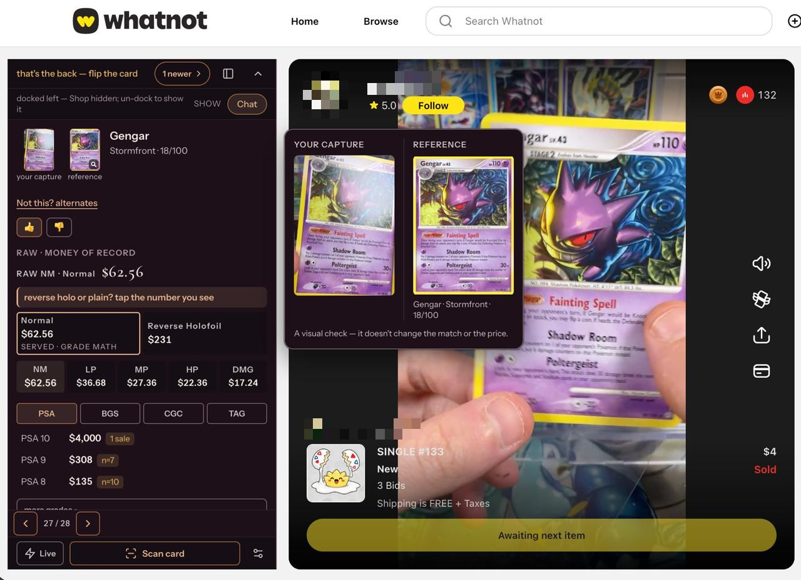

<!--
This is the scout, today. It's a browser extension I built that identifies trading cards on live
auction streams [arc B]. A card comes up on the stream, and the scout's overlay says which card it
is ⟨check against the shot: name the card and what the overlay shows⟩. The usernames are pixelated; the rest is as it looked. What
you can't see in a still is the part I care about: it lands and it stays put. In August the same
step took somewhere between six and fifteen seconds, and then it changed its mind on screen
[arc B; D14]. I'll show it to you live in a few minutes. First, how it got here.
-->

---

<!-- _footer: "Source: mining/arcs/B-pivots.md (bakeoff 3f5eabd7e, 08-18; SigLIP 423e2e894, 08-20); EXP-E88 (09-11); D14, D18" -->

## How we got here

Identify: 6–15 s live in August → under half a second by September 11.

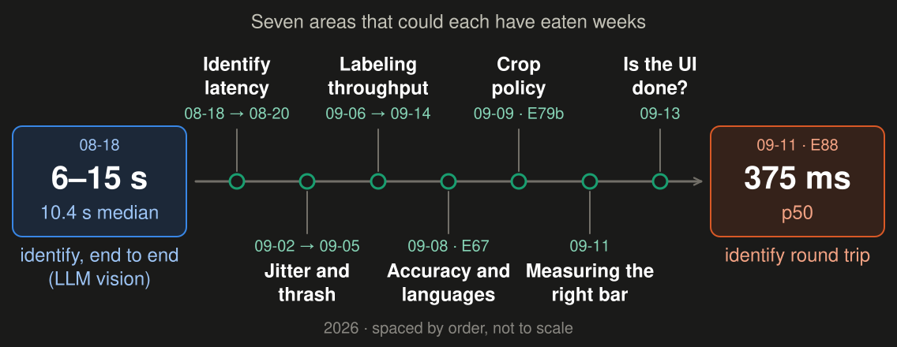

<!--
Here's the whole trip on one line. In August the scout's identify was an LLM vision call: six to
fifteen seconds live, and a 10.4-second median when we benchmarked it overnight on August 18th
[arc B; G:3f5eabd7e · 08-18]. Two nights later an image-embedding model won on speed, at 44 ms
[arc B; G:423e2e894 · 08-20]. By September 11th one identify round trip was about 375 ms at the
median [P1]. Along the way there were seven places that, in my experience, could each have eaten
weeks: latency, the jitter, accuracy across languages, the crop policy, labeling throughput,
knowing when the UI was done, and measuring the right bar [arc B; D14; arc A; D18; D7; arc C;
lot-top3]. The rest of this talk is how each one went, and which method it took.
-->

---

<!-- _class: story -->

## The first sign

> Identify got fast enough to flap. That was the first sign we were onto something.

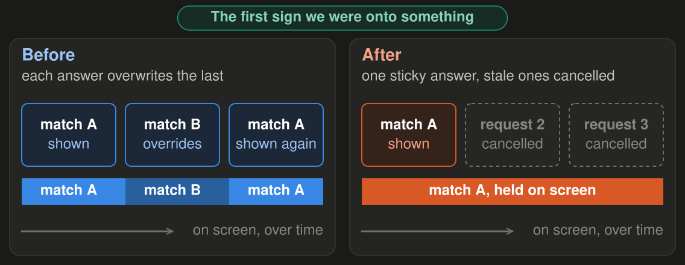

<!--
Here's the moment I now think of as the first sign we were onto something. It didn't feel like
it. On September 2nd I ran my first instrumented live session, and the scout was locking and
unlocking at least once a second. When it didn't clobber itself, it identified well
[G:70b2f1b9e · 09-02; D14]. On screen it was super jittery, not close to usable. But everything
under the presentation layer looked promising [abstract]. It could only flap because identify had
got fast enough to change its mind [D16]. The question had moved from "can this work at all" to
"which of many fixes".
-->

---

<!-- _class: story -->

## The fork

> Every area fanned out into parts, and every part into experiments. The old move: pick the fix I know, and push.

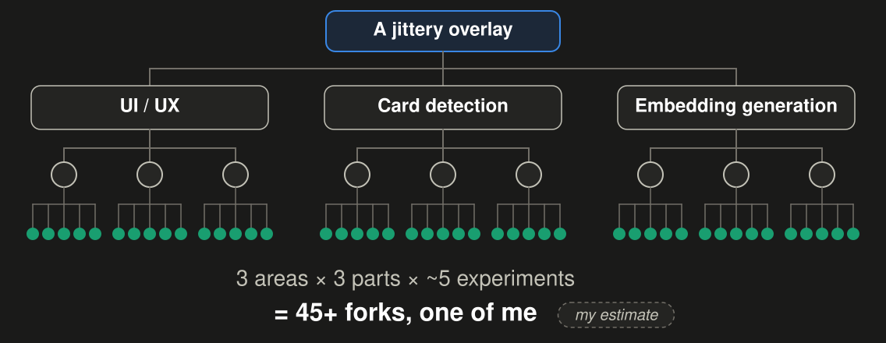

<!--
And that's a fork. I could attack the jitter from three areas: the UI, card detection, or how we
generate embeddings. Each area had at least three parts of the system to explore, and each part
about five experiments [abstract]. That's forty-five forks or more for one bug, and that grid is my
own count, not something in the record [P5]. Every project is boxed by scope, staffing and
timeline [brief]. Identify still wasn't fast enough end to end to win an auction, and the project
had come close to being parked [D4]. So the old move is obvious: pick the fix I know best, push
through, and hope.
-->

---

## What changed

“About half an hour a day of my time, setting agents up for the night.” <cite>my estimate</cite>

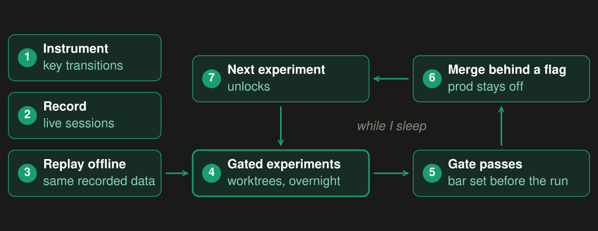

<!--
What changed wasn't a smarter model. It was three steps. Instrument the key transitions, so I
could see where it flapped: PostHog events, plus a record of every fire [P2; G:1267e680e · 08-22;
G:3c52c2b72 · 09-04]. Replay that data offline, so an experiment doesn't need a live stream [P2].
Then run gated experiments, each in its own git worktree, many of them overnight [P3; P4]. When a
gate cleared, the work merged and the next experiment unlocked [abstract; P4]. That came to about
a hundred experiments in two weeks [D13]. My part was about half an hour a day, spread across the
day, setting agents up for the night. That's my estimate, not a measurement [D16].
-->

---

<!-- _footer: "Source: EXP-E19 (Grailith, 09-05), via decisions.md D14" -->

## Jitter, resolved

Answers thrown away per 100: 35.8 → 15.4 → 0.14, measured against a control.

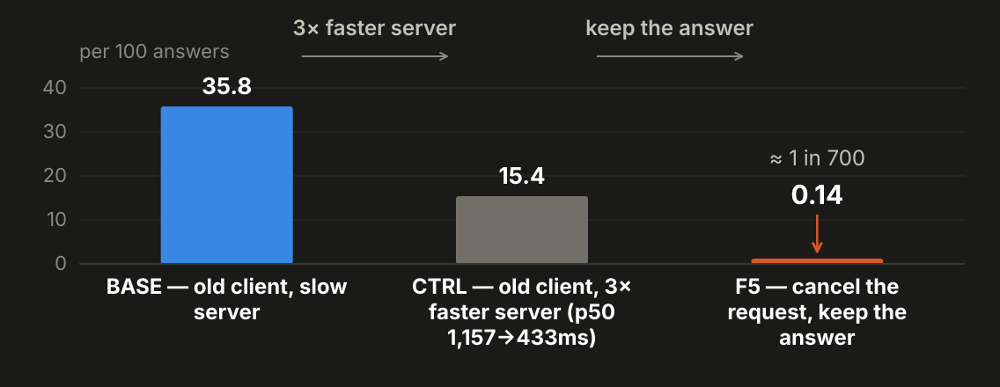

<!--
So here's how the jitter story ends, early. On September 5th we measured it against a control, in
an experiment called E19 [D14]. The data showed us where it was flapping. A 3× faster server cut
thrown-away answers from 36 to 15 in every 100; then one behaviour change, cancel the request but
keep the answer, took it to about 1 in 700. Three days from the first instrumented complaint
[D14; E19: 35.8 → 15.4 → 0.14 per 100]. Both levers get credit. Crediting only the behaviour
change would overclaim [D14]. And one of my three areas, the embedding model, never needed an
experiment for the jitter at all [D14].
-->

---

<!-- _class: demo -->

## Demo · the card scout, live

the scout, live →

<!--
Enough history. Here it is, live, on a real stream. The extension proposes several crops of the
card, the server turns each into an embedding, and the crops vote on the answer [D18;
G:3079bbc68 · 09-02]. That vote is a fork the experiments settled, and not the way I first read it.
E79 compared padding on one chosen crop: pad it about 17 pixels and it helps. It never replaced the
vote, and a replay today of running without it locked wrong cards [D18; D12]. So the rule is: pad
the crop about 17 pixels, and keep the vote [D18]. Watch the card. It identifies, and it holds. If
it misses, that's the one-in-three I'll show you in a few minutes [lot-top3].

**Stage (5.0 min, the live demo).**
1. Before the talk: load the dev-box build in the presenting browser with the vote ON
   (`cropMode: "proposals"`) and point it at the dev stack; confirm the stack answers from the
   venue network; open a stream tab with cards on screen [D18]. ⟨from demo lane: the exact build,
   the health check and the stream to use; no hostnames in the repo⟩.
2. On this slide, switch to the stream tab. Wait for a card. Point at the overlay as it identifies,
   then leave it alone for a few seconds so the room sees it hold. Let two or three cards go by.
3. If a card is wrong, say: "That's one of the misses." Don't retry on stage.
4. Fallback: if the stream or the stack isn't answering within 15 s, play the recorded clip, a
   local file that is not in the repo, and say it's recorded. Never present it as live. Slide 2's
   screenshot is the last resort.
5. Return to the deck, slide 9.
-->

---

## Which method fits which problem

Problem type → method → the slide where you'll see it.

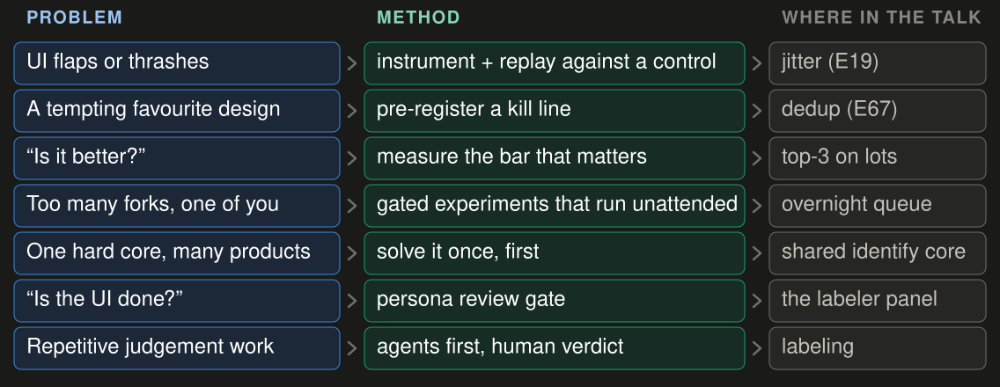

<!--
Now the methods, because the jitter was one fork of many, and they didn't all want the same tool.
Here's the map. A fork with many plausible fixes wants orchestration: parallel lanes [arc E]. To
let those lanes run while you sleep, you need gates and flags [gates-and-flags]. An idea you want to be true
wants a kill line, written before the run [arc A]. "Is it good enough?" wants the bar measured in
the product's own units [lot-top3]. A long list of possible work wants gates that let you stop
[G:ledger]. One hard piece that several things depend on: solve it first [D11]. "Is the UI done?"
wants a persona review gate, and your own hands last [arc C]. Repetitive judgment work: agents
first, a human verdict [arc F]. One slide each.
-->

---

<!-- _footer: "Source: this repo's merge log; mining/arcs/E-coordinator.md" -->

## Method: orchestration

<b>Lane:</b> one task, its own worktree · <b>Gate:</b> pass/fail, written first · <b>Reviewer:</b> one tier up

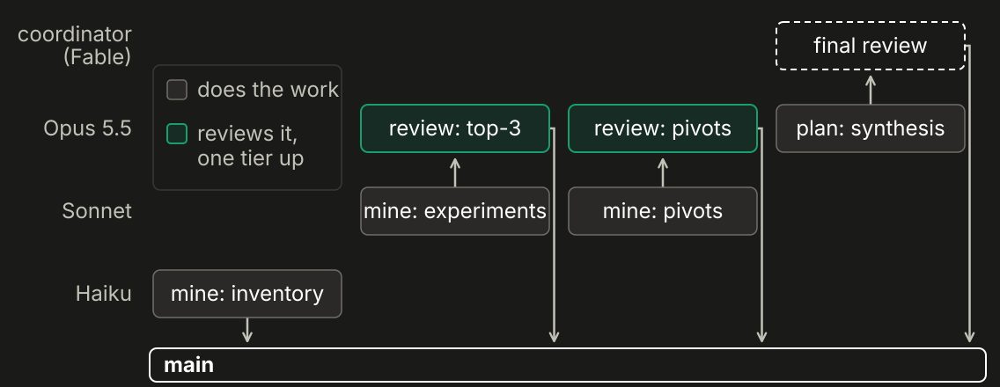

<!--
Orchestration first, because everything else ran on it. One senior session, the coordinator,
writes the brief: files, acceptance tests, what's off limits. Cheaper models build to it, each in a
lane: one task, its own branch and worktree, so lanes never collide [arc E]. A gate is a pass/fail
check written before the work. The reviewer always sits one tier above whoever built it, never a
peer [arc E]. Lanes commit early, because a usage limit killed three build lanes mid-work on
September 7th [arc E]. This chart is this talk repo's own lanes. It isn't free: an early rule
letting the swarm steer itself broke the next day, and I had to keep correcting it [arc E].
-->

---

<!-- _footer: "Source: mining/findings/gates-and-flags.md (Grailith backlog + ledger; EXP-E67, E84; 09-05 → 09-09)" -->

## Method: gates and flags

Unattended runs: gates decide the merge; flags keep it reversible.

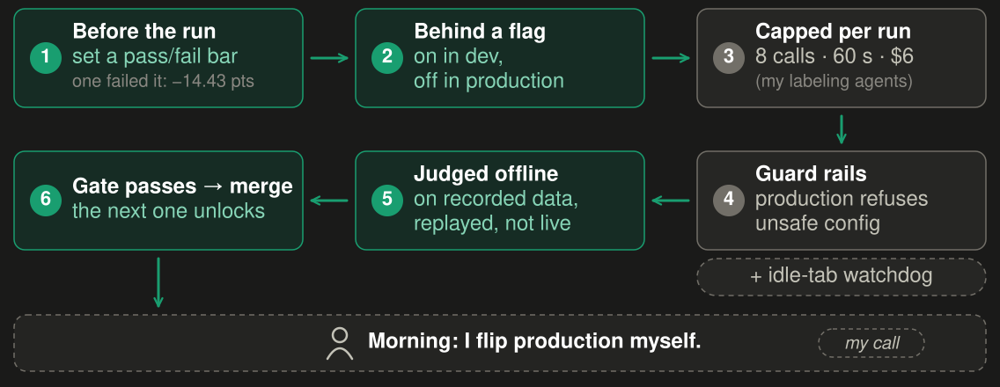

<!--
Here's what let experiments run while I slept. Five steps. I hand over a window with an end time. The queue goes in with each gate and the
night's hard rules stated up front. Each result re-grooms the queue. Gates are judged on frozen,
offline data, so no verdict needs a live stream. And in the morning I get one file, and only the
calls only I can make, like flipping production [gates-and-flags]. Four mechanisms hold it up. A
kill bar written first: E67's fired. Flags on in dev, off in prod: the language head went live on
September 9th on my word. Caps per run: 8 calls, 60 seconds, $6, raised to 14 when agents hit
the wall. And production refuses unsafe config at boot [gates-and-flags]. It isn't airtight. An
idle Chrome tab burned a full day's API allowance overnight before anyone noticed. The watchdog came
after [gates-and-flags].

**Stage (4.0 min).** This is the focus slide. Slow down. Walk the diagram left to right as you name
each step, then point at each mechanism once. Don't quote any credit or dollar amount for the idle
tab; "a full day's allowance" is the line.
-->

---

<!-- _footer: "Source: mining/arcs/A-experiments.md; mining/findings/E67-top3-replay.md" -->

## Method: kill lines in action

My favourite idea hit its kill line; a small language head shipped instead.

<!--
Kill lines are for the idea you want to be true. Japanese cards were scoring higher similarity than
English ones, and a census found 96 % of 19,258 Japanese renders had an English twin with
identical art [arc A]. My instinct was to de-duplicate the index. The kill line was written down
before the run. De-duplication lost 14.43 points of top-1, and the kill fired [arc A]. Scoring past
it, keeping the flat index and adding a small language head lifted top-1 from 67.66 % to 77.61 % on
201 test crops: 20 fixed, none broken [arc A; E67-top3]. It shipped on September 9th [arc A]. The
idea I expected to win lost, and that loss found the change we shipped.
-->

---

<!-- _footer: "Source: mining/findings/E67-top3-replay.md; mining/findings/lot-top3-unlocked.md (n = 87 lots)" -->

## Method: measure the bar

At top-3 the gain halves. On live lots: right card in the top 3, about 2 in 3.

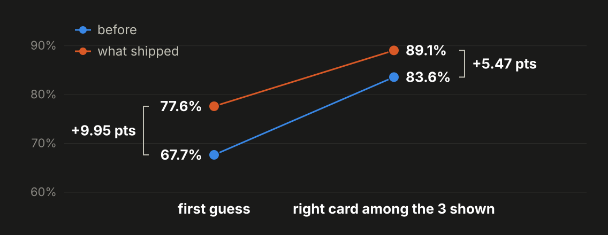

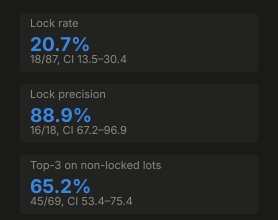

<!--
But top-1 isn't my bar. My bar is top-3: the right card somewhere in the picker's three
candidates [top3-traj]. Replayed at top-3, after checking the replay reproduced the top-1 numbers
exactly, the same win goes from 83.58 % to 89.05 %. Real, but plus 5.47 points, not 9.95
[E67-top3]. Then the bar that matters, live lots. Of all 87 truth lots in the record, the scout
didn't auto-lock 69, and on those the right card was in the top 3 in 45. That's 65.2 %, with an
interval of 53 to 75 % [lot-top3]. The truth is my own taps, one tapper, five days of streams
[lot-top3]. About two in three. Not done, but measurable, and I know which number to move.
-->

---

## Method: stop things

- An encoder swap: 9.55 points down. Stopped.
- A fine-tune and a distilled student: both failed their bars.
- Re-embedding the reference art: never started.
- Paying for more Japanese art: zero lift, not scaled.

<!--
Gates pay off as much in what they let you stop. We stopped a SigLIP2 encoder swap that came in
9.55 points down [G:ledger · E57]. The fine-tune and the distilled student both failed their bars
[G:ledger · E58, E53d]. We never re-embedded the reference art [G:ledger · E12, E39]. And paying for
more Japanese art showed zero lift, so we didn't scale it [G:ledger · E119]. A lot of the hundred
experiments were like these: they saved time by returning a clean no, and nobody had to argue
about it afterwards.
-->

---

<!-- _footer: "Source: decisions.md D11; mining/arcs/B-pivots.md (08-20, 09-02, 09-03)" -->

## Method: hardest shared core first

One identify core for bulk scan and the scout; the LLM came out of both.

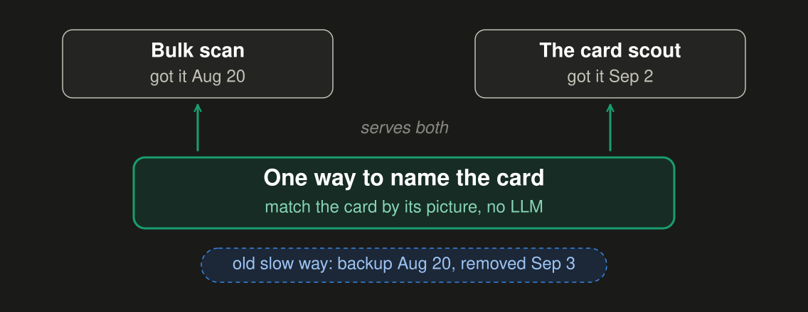

<!--
Some problems aren't forks; they're foundations. Identify was the hardest part of the whole system,
and two apps needed it: bulk scan and the scout. Every app like them I'd tested was slow and
inaccurate [D11]. So I solved it once, as a shared core, and built both apps around it. Bulk scan
got the embedding-first lane on August 20th, the scout on September 2nd, and the old LLM identify
was retired from both on September 3rd [D11; G:5f76f4810 · 08-20; G:06119bc92 · 09-02;
G:0d12da755 · 09-03]. The embedding became a ranker, never the authority on its own [arc B]. Solve
the hardest shared piece first, and you're free to focus elsewhere [D11].
-->

---

<!-- _footer: "Source: mining/arcs/C-personas-review.md (09-13 21:50 → 09-14 09:40)" -->

## Method: persona review gates

**Brief · Dez:** 22, phone-only, one thumb. Job: “swipe-fast, not homework.”

**Panel:** DONE.

“Pretty much unusable.” <cite>me, on my own iPhone, next morning</cite>

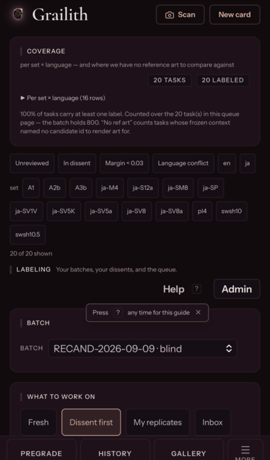

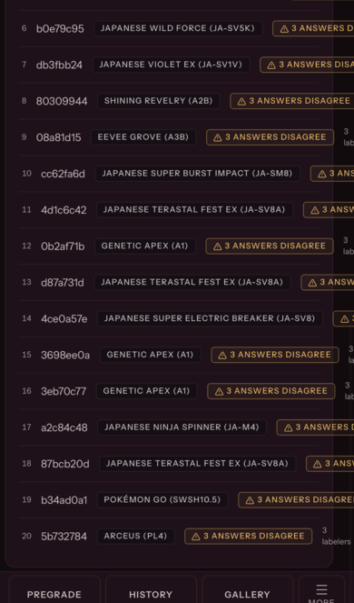

<!--
For UI and design work, "done" needs a gate too, and code-done isn't it. On September 13th I made a
design panel the done gate: four fictional personas, each a short brief with a device and a job,
plus three critics [arc C]. Dez is 22, phone-only, one thumb. The panel re-walks the built screens
and returns DONE or NOT, with blockers. Dez went from 30 seconds a task to 9, simulated, not human
[arc C; arc F]. Then the gate failed. The panel said DONE on the phone at 21:50. At 09:40 the next
morning I opened the deployed app on my own iPhone, and it was pretty much unusable: three
scrolling sections, a help modal on every task, rotating the phone to reach options [arc C]. The
panel walked a fixed viewport [arc C]. It's necessary. Your own hands on the real device are the
last gate.
-->

---

<!-- _footer: "Source: decisions.md D7; mining/arcs/F-agent-labeling.md (E84)" -->

## Method: agents first, human verdict

“I timed myself on the first labeler build.” <cite>testimony</cite>

<!--
Labeling is repetitive judgment work. By hand it took me about three minutes a label. That's my own
stopwatch on the first labeler build; the message isn't in the record we mined [D7]. With agents
doing the first pass, that dropped to 11 to 16 seconds of agent wall time, and the agent was boxed
in: 8 calls, 60 seconds and $6 a run at most [arc F]. Then my review, after a persona-driven
redesign of the review screen, took about 20 to 30 seconds [D7; arc F]. The fair total is about 31
to 46 seconds end to end, agent plus review [D7]. Two levers: agents took the first pass, and a
redesign made my verdict fast. Crediting agents alone would overclaim [D7].
-->

---

## Two things for next week

1. **Run your next fork as gated experiments that can run unattended.**
2. **Put a persona review gate in front of “done” for UI and design work.**

github.com/gsornsen/htsysadath · starter kit: starter/

<!--
Here's what I'd tell a colleague. When you come to the next fork in the road, ask how you could get
an answer while you focus on something else [abstract]. So, two things for next week. One: run your
next fork as gated experiments that can run unattended. Write the gate first, give each option its
own worktree, and put anything risky behind a flag [gates-and-flags; arc E]. Two: put a persona review gate in
front of "done" for UI and design work, and then check it with your own hands [arc C]. Give agents
the right context, autonomy and guardrails, and they work like extra copies of you [abstract]. It's
all in the repo, with a starter kit in `starter/`. Thanks.
-->

---

<!-- _class: backup -->
<!-- _paginate: false -->

## Backup · cost, hours, hold-out

- **Cost:** all Claude work within a Claude Max subscription; the only metered model spend was the labeling pilots, ~$9 for 760 tasks.
- **Hours:** ~30 minutes a day, spread across the day, setting agents up for overnight runs: my estimate.
- **Held out:** the language head trained on catalogue images only, its one knob set on a separate dev split; none of the 201 test photos in any of it.

<!--
Q&A only. All of the Claude work ran within my Claude Max subscription. The only metered model spend
in the record is the labeling pilots: about $9 for 760 tasks [D13]. My own time was about thirty
minutes a day, spread across the day, setting agents up for overnight runs. That's my estimate;
nothing in the record measures it [D16]. And the question I get about slide 12, held out? Yes. The
language head never saw a real photo while it trained: catalogue images only, its one knob set on a
separate dev split, and none of the 201 test photos in any of that [D14]. If pressed: it has seen
the catalogue image of the true card, which is the gallery, known at inference, not leakage [D14].
-->

---

<!-- _class: backup -->
<!-- _paginate: false -->
<!-- _footer: "Source: mining/findings/top3-trajectory.md; mining/findings/lot-top3-unlocked.md" -->

## Backup · four yardsticks

We measured top-3 four ways; you can't draw one line through them.

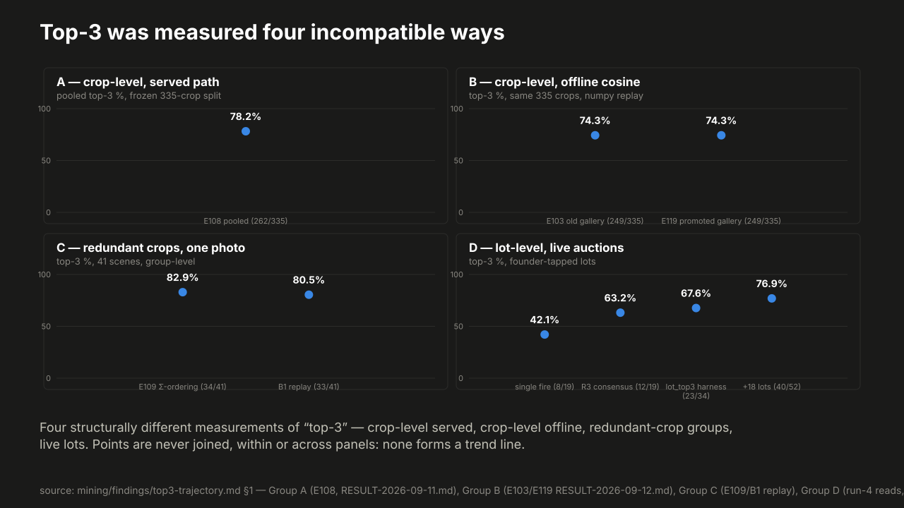

<!--
Q&A only, if someone asks "so what is the accuracy?". We measured top-3 four different ways, and
they don't agree. Crops as served: 78.2 %. The same crops scored offline: 74.3 %. A six-crop
consensus proxy: 70.3 % up to 82.9 %. And live lots, pooled: 71.3 %, with 65.2 % on the lots that
never auto-locked [top3-traj; lot-top3]. Four yardsticks. You can't draw one trend line through
them, which is why slide 13 picks one bar and says which [lot-top3].
-->
